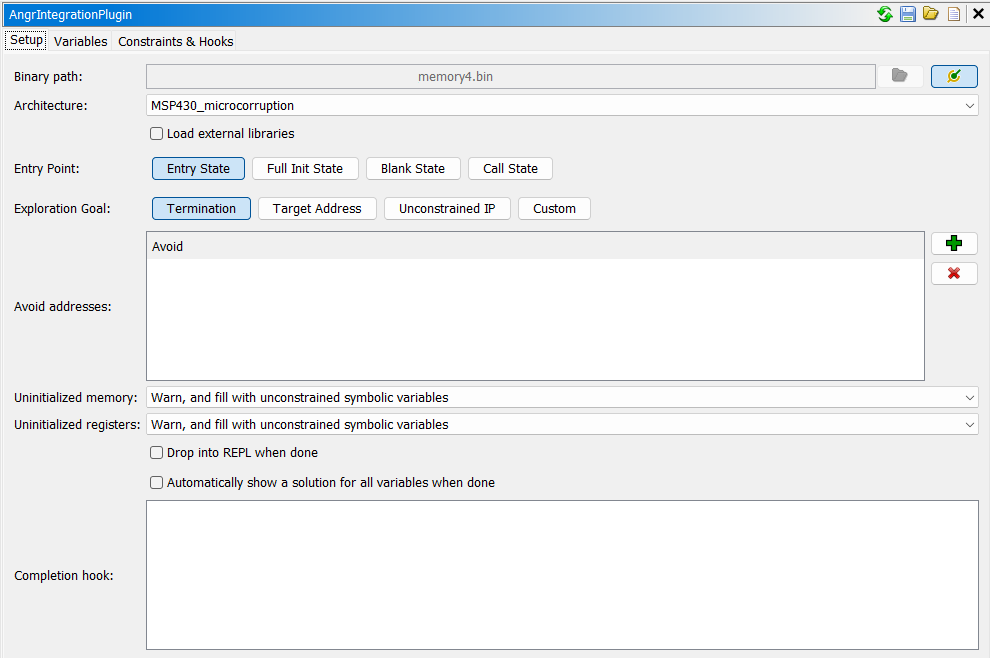
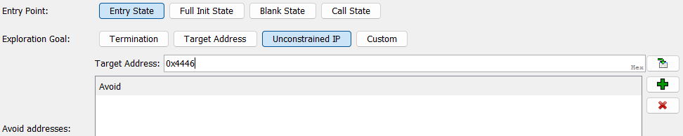

# angr pcode Example - microcorruption Cusco

To demonstrate use of the pcode features in angr and some of the rest of angr's featureset, this document
describes an angr-assisted solve of the fourth microcorruption challenge, named
[Cusco](https://microcorruption.com/debugger/Cusco). The microcorruption challenges are a set of MSP430 memory images
that model a door lock, with varying levels of security. In Cusco, the vulnerability is a buffer overflow in the
password input, which can be used to jump to the procedure at `0x4446` which unlocks the door.

Initially the example here just uses angr in a REPL or notebook, with no involvement with the Ghidra Angr Integration Tool. At the end we show how to solve this problem with GAIT.

## Setup

The memory image, `memory4.bin`, can be downloaded from the [challenge page](https://microcorruption.com/debugger/Cusco). Create a venv and install angr as in the [howto](howto-angr.md) file:

```bash
$ python -m venv .venv
$ source .venv/bin/activate
(.venv) $ pip install angr setuptools pypcode 
```

```python
$ python
>>> import claripy, archinfo, cle, angr
```

## Initial Static Analysis

Consulting the [MSP430 manual](https://www.ti.com/lit/ug/slau049f/slau049f.pdf) section 2.1.3, we can see that on
startup, the processor loads the memory at the reset vector `0xFFFE` into the program counter, giving an entry point of
`0x4400`. The microcorruption website has symbols (although the binary does not) showing that main is at address
`0x4438` and the function `unlock_door` is at `0x4446`. The program takes a password, using the `gets` interrupt,
compares it with one in some ideal HSM, and then decides if to unlock the door or not based on the result of the
comparison.

This is an excellent showcase of what angr can do: in many cases, such as this one, you really don't need very much
information on what the program is doing beyond these basics.

## Loading the binary

Before angr can get to work, it needs to have the binary loaded into simulated memory first. The dump covers the entire
address space, from `0x0` to `0xffff`, which means just trying to naievely load it will fail (more on the default cc
warning later):

```python
>>> loader = cle.Loader("memory4.bin",
                    main_opts={
                        "backend": "blob",      # this isn't an elf
                        "entry_point": 0x4400,  # found using static analysis 
                    },
                    arch=archinfo.ArchPcode(language="TI_MSP430:LE:16:default"))  # from ghidra

>>> p = angr.Project(loader, engine=angr.engines.UberEnginePcode)  # Specify to use the pcode engine
WARNING  | 2024-07-11 09:07:37,909 | cle.backends.blob | No base_addr was specified for blob memory4.bin, assuming 0
WARNING  | 2024-07-11 09:07:37,910 | angr.engines.pcode.cc | Unknown default cc for arch TI_MSP430:LE:16:default


---------------------------------------------------------------------------

CLEOperationError                         Traceback (most recent call last)

        1 loader = cle.Loader("memory4.bin",
        2                     main_opts={
        3                         "backend": "blob",      # this isn't an elf, it's an orc
        4                         "entry_point": 0x4400,  # found using static analysis 
        5                     },
        6                     arch=archinfo.ArchPcode(language="TI_MSP430:LE:16:default"))  # from ghidra
----> 8 p = angr.Project(loader, engine=angr.engines.UberEnginePcode)  # Specify to use the pcode engine


...

File ~/.venv/lib/python3.12/site-packages/cle/loader.py:1077, in Loader._find_safe_rebase_addr(self, size)
    1075             break
    1076     else:
-> 1077         raise CLEOperationError("Ran out of room in address space")
    1079 return gap_start

CLEOperationError: Ran out of room in address space
```

The somewhat unhelpful error message 'Ran out of room in address space' occurs because angr allocates a small amount of
scratch space to store data that needs to be in simulated memory, such as addresses for function hook continuations
(function pointers used when a python function hook wants to call back into the real binary), but the binary being
loaded covers the entire 16-bit address space.

To resolve this, just truncating the binary will not suffice -- there are important interrupt vectors at the very high
end of the address space that should be preserved. Instead, use the segments feature of the `blob` loader to carve out
an area of the memory space that's being loaded with empty bytes, for use by angr instead. By default angr has a very
large granularity of it's object addresses, attempting to only allocate on multiples of `0x100000`, so that must also be
reduced to something more sensible for a 16-bit address space:

```python
>>> loader = cle.Loader("memory4.bin",
                    main_opts={
                        "backend": "blob",
                        "entry_point": 0x4400,
                        "base_addr": 0x0,
                        "segments": [(0x0, 0x0, 0x4fff),(0x6000, 0x6000, 0xffff-0x6000)]
                    },
                    arch=archinfo.ArchPcode(language="TI_MSP430:LE:16:default"),
                    rebase_granularity=0x100)
>>> p = angr.Project(loader, engine=angr.engines.UberEnginePcode)
```

Inspection of the binary showed a large unused space in the area `0x5000` to `0x5fff`, which should be plenty of room
for angr's scratch region. The first empty region is from `0x0010` to `43ff`, but this area of flat memory space is
mapped by the MSP430 to RAM, so another (ROM-mapped) region was chosen.

At initialisation time, any non-ROM memory or register can be assumed to be 0. Here, we create a state and set options
that arrange for that to be the case, rather than angr's default behavior of defining a symbolic variable for each
uninitialised read:

```python
>>> st = p.factory.entry_state()
>>> st.options.add("ZERO_FILL_UNCONSTRAINED_MEMORY")
>>> st.options.add("ZERO_FILL_UNCONSTRAINED_REGISTERS")
```

Now that the binary is loaded, the natural next step is to setup the symbolic inputs that will be used for the password
input in the lock. However, in it's current state, angr knows how to simulate the translated pcode and not much else.
The MSP430 definetly doesn't use standard posix syscalls to get input or write output - instead, the specific
microcorruption machine has an interrupt (using a call gate at `0x0010`) to perform various functions such as reading or
writing to the console, interfacing with the HSM, or opening the lock. This needs to be emulated by angr for proper
simulation, and the easiest way to do this is with a _hook_.

A hook causes execution to jump into a user defined python function when execution reaches a certain address. It's used
throughout angr to implement syscalls or library functions where symbolically executing the real code leads to state
explosion.

The full interrupt handler hook has a few moving parts, so here's a simple example for now:

```python
>>> @p.hook(0x4438, length=0)
    def my_hook(state):
        print("Reached hook!")
        return []   # forcibly terminate simulation here, since angr
                    # doesn't yet understand when the machine has halted
                    # so will run forever

>>> # Test out our hook
>>> sm = p.factory.simgr(st)
>>> sm.run()
Reached hook!
<SimulationManager with 1 deadended>
>>> p.unhook(0x4438)  # remove the hook so it doesn't break things later
```

The return value of the hook is a list of `SimState`s (the type of `state`) representing the possible next states that
could occur after execution of the hook. Here it's set to the empty list, because execution should not continue past the
hook.

The length parameter sets how many instructions the hook should skip after execution - useful if you're replacing a few
instructions with a more efficient python version.

Now, here's the full syscall handler:

```python
>>> @p.hook(0x0010, length=0)
    def int_hook(state):
        successors = []  # This will hold the set of possible states after running the interrupt

        # The interrupt code is stored in the high byte, without the top bit, of the sr register 
        interrupt_code = state.regs.sr[14:8].zero_extend(1)

        if not state.solver.is_false(interrupt_code == 0x0):  # putchar
            new_state = state.copy()
            new_state.history.jumpkind = "Ijk_NoHook"  # Tell angr that this state is the result of exiting from a hook here
            new_state.scratch.guard = interrupt_code == 0x0

            param1 = new_state.memory.load(state.regs.sp+0x8, size=1)  # The char to write
            stdout = new_state.posix.get_fd(1)  # This isn't 'real' posix but it's the standard way of buffering i/o
            stdout.write_data(param1)

            successors.append(new_state)

        if not state.solver.is_false(interrupt_code == 0x2):  # gets
            new_state = state.copy()
            new_state.history.jumpkind = "Ijk_NoHook"
            new_state.scratch.guard = interrupt_code == 0x2
            stdin = new_state.posix.get_fd(0)

            param1 = new_state.memory.load(state.regs.sp+0x8, size=2)  # The address to write the data to
            param2 = new_state.memory.load(state.regs.sp+0xA, size=1)  # Max size read

            (data, real_length) = stdin.read_data(state.solver.eval(param2))
            new_state.memory.store(param1.reversed, data)  # fix endianness

            successors.append(new_state)

        if not state.solver.is_false(interrupt_code == 0x7D):  # HSM-1 trigger
            new_state = state.copy()
            new_state.history.jumpkind = "Ijk_NoHook"
            new_state.scratch.guard = interrupt_code == 0x7D

            # nop

            successors.append(new_state)

        if not state.solver.is_false(interrupt_code == 0x7F):  # unlock door
            new_state = state.copy()
            new_state.history.jumpkind = "Ijk_NoHook"
            new_state.scratch.guard = interrupt_code == 0x7F

            new_state.globals["lock_unlocked"] = True  # mark the door as unlocked

            successors.append(new_state)

        if len(successors) == 0:  # If none of the interrupt handlers fired
            # oh no! fallback to modelling the interrupt as a nop
            new_state = state.copy()
            new_state.history.jumpkind = "Ijk_NoHook"
            successors.append(new_state)
            print("Error: unhandled interrupt ", interrupt_code)

        return successors
```

This function implements 4 interrupts: two emulating standard libc functions `putchar` and `gets`, one to trigger the
HSM-1, and one to trigger the door unlock. This cannot be a simple switch based on the `interrupt_code`! It's possible
that the code could be symbolic, and therefore multiple interrupts could occur from the same root state.

To model this, we use the `successors` array that's built up over the course of the function, with each branch adding
it's state only if it's not impossible to for the real code to be that. For example, if the `interrupt_code` is
represented by the symbolic variable 𝖆, there could be a constraint `< 𝖆 < 0x40 >` through some earlier execution,
which would mean only the first two branches would have a chance of being executed, since the other two would violate
the constraint.

Once inside a branch, a new state is created, and a guard constraint is added ensuring that in paths where that state is
taken, the `interrupt_code` really _is_ the correct code for that interrupt. The `jumpkind` is also set, which is only
relevant to VEX emulation but must still be present.

Then, the actual state-mutating activity of the interrupt occurs. In `putchar` and `gets`, arguments are read from the
stack (this special microcorruption interrupt does not follow the standard MSP430 calling convention), the `posix`
emulation layer is used to get file descriptors for `stdout`/`stdin`, and they are read from or written to respectively.
This is similar to how angr emulates 'real' linux `putchar` and `gets`! Most standard library functions are defined by
hooks like this -- the posix field just acts as a convenient way to store the input and output.

The HSM trigger interrupt is modelled as a nop. In the real machine, this will read a password from memory, compare it
to the one stored in the HSM, and overwrite a flag in memory if the password is good. However, from a reversing
perspective, the password stored in the HSM is unknown, so any password given to the interrput is assumed to be
incorrect, which means the HSM does nothing.

The unlock door interrupt doesn't mutate the actual state, but instead sets a flag in the `globals` member. This
doesn't affect simulation, but can be checked later on to see if the door was ever unlocked.

Finally, there's a fallback preventing execution from completely halting if none of the interrupt handlers fired. The
completed successors array is then returned, completing the interrupt hook.

Now, there's one more thing to do before angr understands enough about the machine to simulate it: halting conditions.
The MSP430 lacks a dedicated `hlt` instruction, and there's no operating system to return to or `exit()` call to hook.
Instead, bit 11 of the status register `sr` represents the CPUOFF flag, which halts the system. There are a number of
different ways to halt simulation once that bit is set, but the most useful is a custom `ExplorationTechnique`:

```python
>>> class MSP430HaltTechnique(angr.exploration_techniques.ExplorationTechnique):
        def filter(self, simgr, state, **kwargs):
            if state.solver.is_true(state.regs.sr.chop(1)[11] == 0x1):  # CPUOFF flag in status register
                return 'deadended'
            else:
                return simgr.filter(state, **kwargs)
```

When the simulation advances to it's next step, each state passes through each active `ExplorationTechinque`'s `filter`
function, which determines if it should continue executing or not. The function tests the bit, in the current state, and
if it's set returns 'deadended', which signals to the simulation that this particular state should not be simulated any
longer. Other return values are possible - see [the relevant section of howto-angr.md](howto-angr.md#simulationmanager-stashes) for more details.

Now, it's finally time to setup some input symbolic variables. This isn't strictly nessecary - angr will model reads to
an unconstrained stdin symbolically - but is instructive and can be useful if, eg, something else is constraining your
input to printable characters. Individual 8-bit variables are created, then concatenated into a single expression that's
used as stdin:

```python
>>> stdin_len = 32
>>> stdin_chars = [claripy.BVS(f"stdin_{i}", 8) for i in range(stdin_len)]
>>> stdin_ast = claripy.Concat(*stdin_chars)
>>> st = p.factory.entry_state(stdin=stdin_ast)
WARNING  | 2024-07-11 09:07:38,458 | angr.simos.simos | stdin is constrained to 32 bytes (has_end=True). If you are only providing the first 32 bytes instead of the entire stdin, please use stdin=SimFileStream(name='stdin', content=your_first_n_bytes, has_end=False).
>>> # Reset the options from earlier, since this is a new state
>>> st.options.add("ZERO_FILL_UNCONSTRAINED_MEMORY")
>>> st.options.add("ZERO_FILL_UNCONSTRAINED_REGISTERS")
```

Now all that remains is to actually run the emulation. The explore call will essentially perform a breadth first search
on the program, executing every current state forward a step until either

- all states cannot be executed further
- one is found such that the lambda find returns True (i.e. the lock is unlocked)

```python
>>> st.globals["lock_unlocked"] = False
>>> sm = p.factory.simgr(st)
>>> sm.use_technique(MSP430HaltTechnique())

>>> sm.explore(find=lambda state: state.globals["lock_unlocked"])
WARNING  | 2024-07-11 09:07:40,179 | angr.engines.successors | Exit state has over 256 possible solutions. Likely unconstrained; skipping. <BV16 stdin_17_17_8 .. stdin_16_16_8[7:1] .. 0>

<SimulationManager with 1 unconstrained>
```

The emulation has reached a point where the instruction pointer is unconstrained. By default angr halts simulation here,
since it would have to create a new state for every possible jump point i.e. the whole address space. angr also reports
that the value of the pc is based on the concatenation of two symbolic variables with `stdin` in the name -- these are
the symbolic variables that were defined earlier! More explicitly:

```python
>>> sm.unconstrained[0].regs.pc
<BV16 stdin_17_17_8 .. stdin_16_16_8[7:1] .. 0>
```

Now, the goal is to get the program to jump to the `unlock_door` function discussed earlier, at `0x4446`. Whilst you can
probably figure out how to get there based on the unconstrained pc above, it's easier (especially if the expression was
more complex than this) to get angr to do the heavy lifting:

```python
>>> win_state = sm.unconstrained[0]
>>> win_state.solver.add(win_state.regs.pc == 0x4446)

>>> print(f"stdin (hex): {"".join(["{:02x}".format(win_state.solver.eval(x)) for x in stdin_chars])}")
stdin (hex): 0000000000000000000000000000000046440000000000000000000000000000
```

angr (or more accurately z3 through claripy) has generated a sample solution for the input that will lead to that state! We have won!

But could we do things more elegantly?

## `SimProcedure`s

The above example uses hooks to directly simulate the interrupt hardware of the device. This is a straightforward way of
doing things, but can be awkward when the hardware is complex to model or uses entry methods other than a simple call
gate. The microcorrupton example above has seperate functions, similar to libc, that call the `gets` and `putchar`
interrupts - it might be easier to hook those directly!

You could just hook the address of the functions as above, but then you'd still be left having to manually extract the
arguments from the registers and stack. A much better way of doing this is to use the more general form of a
`SimProcedure`:

```python
>>> class PutsProc(angr.SimProcedure):
        def run(self, c):
            print(c)
            return

>>> p.hook_symbol(0x45a6, PutsProc())

>>> sm = p.factory.simgr(st)
>>> sm.use_technique(MSP430HaltTechnique())
>>> sm.run()
<BV16 0x450c>


---------------------------------------------------------------------------

AttributeError                            Traceback (most recent call last)

...


File ~/angr/calling_conventions.py:929, in SimCC.teardown_callsite(self, state, return_val, prototype, force_callee_cleanup)
    926     if isinstance(loc, SimReferenceArgument):
    927         self.RETURN_VAL.set_value(state, loc.ptr_loc.get_value(state))
--> 929 ret_addr = self.return_addr.get_value(state)
    931 if state.arch.sp_offset is not None:
    932     if force_callee_cleanup or self.CALLEE_CLEANUP:


AttributeError: 'NoneType' object has no attribute 'get_value'
```

This breaks again! angr doesn't know about the calling convention of the MSP430, so you need to give it that as well to
be able to trigger function returns and properly extract arguments. Writing a full calling convention in detail can be
quite time consuming, but for most purposes an approximation is sufficient.

```python
>>> from angr.calling_conventions import SimStackArg, SimRegArg, SimCC

>>> # Basic (not fully accurate) calling convention for the MSP430
    # https://www.ti.com/lit/an/slaa534a/slaa534a.pdf Chapter 3
>>> class SimCCMSP430(SimCC):
        ARG_REGS = ["r15", "r14", "r13", "r12"]  # The first 4 arguments are passed in registers
        RETURN_ADDR = SimStackArg(0, 2)  # Return address is pushed on the stack, offset 0
        RETURN_VAL = SimRegArg("r15", 2)  # Return value is stored in r15
        STACKARG_SP_DIFF = 2  # Any stack args are after the return address
        CALLER_SAVED_REGS = ["r11", "r12", "r13", "r14", "r15"]
        ARCH = archinfo.ArchPcode(language="TI_MSP430:LE:16:default")

>>> # Register the SimCC as default for this architecture
>>> angr.calling_conventions.register_default_cc(archinfo.ArchPcode(language="TI_MSP430:LE:16:default").name, SimCCMSP430)
```

Note that in a real program registering the calling convention should be done _before_ the project is created - this
ensures angr matches things up correctly. You can also specify the calling convention directly in the SimProcedure -
here this is used to verify that the symbolic solution generated above actually works:

```python
>>> p.unhook(0x45a6)

>>> class PutsProc2(angr.SimProcedure):
        def run(self, data):
            print(self.state.mem[data].string.concrete)  # data points to a string, which is then concretized 
            return

>>> class GetsnProc(angr.SimProcedure):
        def run(self, buf, n):
            print(f"reading {n} bytes of data to {buf}!")
            self.state.memory.store(buf, b'\0\0\0\0\0\0\0\0\0\0\0\0\0\0\0\0FD\0\0\0\0\0\0\0\0\0\0\0\0\0\0')
            return

>>> p.hook_symbol(0x45a6, PutsProc2(cc=SimCCMSP430(archinfo.ArchPcode(language="TI_MSP430:LE:16:default"))))
>>> p.hook_symbol(0x4596, GetsnProc(cc=SimCCMSP430(archinfo.ArchPcode(language="TI_MSP430:LE:16:default"))))

>>> sm = p.factory.simgr(st)
>>> sm.use_technique(MSP430HaltTechnique())
>>> sm.explore(find=lambda state: state.globals["lock_unlocked"])

b'Enter the password to continue.'
b'Remember: passwords are between 8 and 16 characters.'
reading <BV16 0x30> bytes of data to <BV16 0x43ee>!
b'That password is not correct.'

<SimulationManager with 1 found>
>>> sm.found[0]
<SimState @ 0x10>
>>> sm.found[0].globals["lock_unlocked"]
True
```

We have found a state which gets to the "unlocked" state. Note that we've kind of cheated here by making our `GetsnProc` SimProcedure return the winning answer, but this is just for demonstration purposes while we show how to get SimProcedures working on this architecture. If we were really trying to solve the problem this way we could easily make `GetsnProc` fill the target buffer with symbolic data and then find an unconstrained state as before.

## Solving with GAIT

The Ghidra Angr Integration Tool makes it simple to solve this problem - many of the MSP430 issues are already implemented in an "MSP430 microcorruption" architecture specification. This ships with GAIT to demonstrate how to implement, e.g. calling conventions, loader arguments, and syscall simulation, for different architectures.

You'll need to have installed the Ghidra Angr Integration Tool extension into Ghidra as described in the [README](README.md).

Load the `memory4.bin` binary into Ghidra: it is just a binary blob so Ghidra cannot recognise its architecture and will want to import it as a raw binary. Choose "MSP430" in the "Language" box in the "Import" dialog.

Now open the binary in a Code Browser and ensure you have set up GAIT's virtual environment in the Tool Options as described in the README. The Angr Integration window should look something like this:



Note how the `MSP430_microcorruption` backend has been automatically selected.

Recall that we want to find something that will get us to an unconstrained state, which we will then want to cause to jump of 0x4446. We select the "Unconstrained IP" exploration goal and fill in 0x4446 as the Target Address:



Now we just hit the Start button and angr will begin symbolic execution of this binary. The `MSP430_microcorruption` architecture specification has dealt with the interrupt handler and the calling convention specification already for us. Progress of the execution will be displayed in the Ghidra console. After a few seconds the execution completes and the following is printed to the console:

```raw
angr [angr_main]> ===== SYMBOLIC EXECUTION COMPLETE =====
angr [angr_main]> Found 1 states.
angr [angr_main]> 
angr [angr_main]> =================== STATE unconstrained[0] ===================
angr [angr_main]> sample stdin: b'\x00\x00\x00\x00\x00\x00\x00\x00\x00\x00\x00\x00\x00\x00\x00\x00\x00\x00\x00\x00\x00\x00\x00\x00\x00\x00\x00\x00\x00\x00\x00\x00\x00\x00\x00\x00\x00\x00\x00\x00\x00\x00\x00\x00\x00\x00\x00\x00'
angr [angr_main]> stdout: b'Enter the password to continue.\nRemember: passwords are between 8 and 16 characters.\nThat password is not correct.\n'
angr [angr_main]> ip: <BV16 packet_0_stdin_2_384[247:240] .. packet_0_stdin_2_384[255:249] .. 0>
angr [angr_main]> lock state: LOCKED
angr [angr_main]> 
angr [angr_main]> Attempting to resolve unconstrained state to target IP...
angr [angr_main]> sample stdin: b'\x00\x00\x00\x00\x00\x00\x00\x00\x00\x00\x00\x00\x00\x00\x00\x00FD\x00\x00\x00\x00\x00\x00\x00\x00\x00\x00\x00\x00\x00\x00\x00\x00\x00\x00\x00\x00\x00\x00\x00\x00\x00\x00\x00\x00\x00\x00'
angr [angr_main]> ip: <BV16 packet_0_stdin_2_384[247:240] .. packet_0_stdin_2_384[255:249] .. 0> = 0x4446
```

angr has found an unconstrained state, and shown us an example input that will cause execution to branch to our desired target address.
